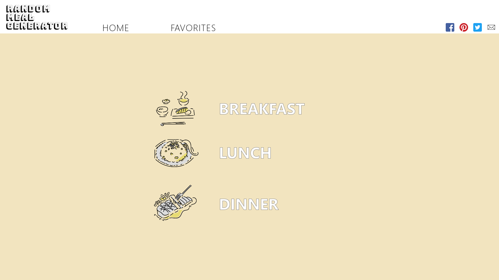
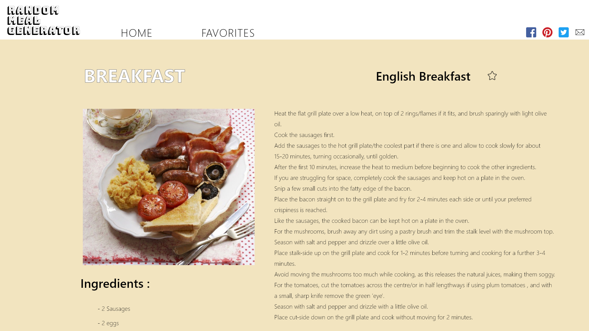
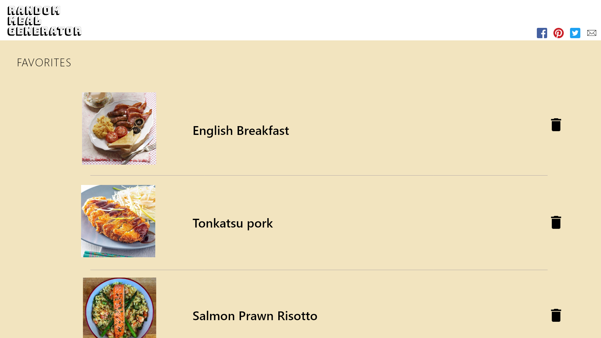

# RANDOM MEAL GENERATOR

## 目的 

忙しい現代人に代わって今日のご飯を提案してくれる、時短・効率系Webアプリです。

スティーブ・ジョブズの、「毎日同じ服を着ることによって服を決める時間的なコストが減り、心理的負担の軽減につながる」という考えを料理を決めるというタスクに当てはめました。このWebアプリを使うことで、ユーザーは他のタスクに時間を使うことができ、他の重要な決断に費やすエネルギーを節約することができることを期待します。

## 使い方

1. Breakfast, Lunch, Dinnerをクリックすると、ランダムに料理サイト/料理レシピが表示される
2. 料理名の右横にある星をクリックしお気に入り登録が可能
3. "FAVORITE"よりお気に入り料理一覧の表示およびお気に入り料理の削除
4. "HOME"よりトップページに戻る
5. SNS（Facebook, Pinterest, Twitter)とメールでWebアプリをシェアすることが可能

## URL

工事中

## 完成イメージ

